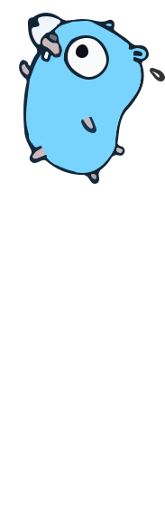

# 深入Go技术栈

* 作者：[Michael.Chow](https://github.com/MichaelChow)
* 开始编写时间：2024.11.30
* 在线电子书：[https://go2.gitbook.io/](https://go2.gitbook.io/)
* 开源电子书项目主页：[https://github.com/MichaelChow/gopher.run](https://github.com/MichaelChow/gopher.run)

### 目录

<table data-view="cards"><thead><tr><th></th><th></th><th data-hidden data-card-cover data-type="files"></th><th data-hidden></th><th data-hidden data-card-target data-type="content-ref"></th></tr></thead><tbody><tr><td><strong>阶段一：Go语言核心</strong></td><td></td><td></td><td></td><td><a href="getting-started/quickstart.md">quickstart.md</a></td></tr><tr><td><strong>阶段二：Go Web开发框架</strong></td><td></td><td></td><td></td><td><a href="broken-reference">Broken link</a></td></tr><tr><td><strong>阶段三：Go项目开发</strong></td><td></td><td></td><td></td><td><a href="getting-started/publish-your-docs.md">publish-your-docs.md</a></td></tr></tbody></table>

<figure><figcaption></figcaption></figure>

