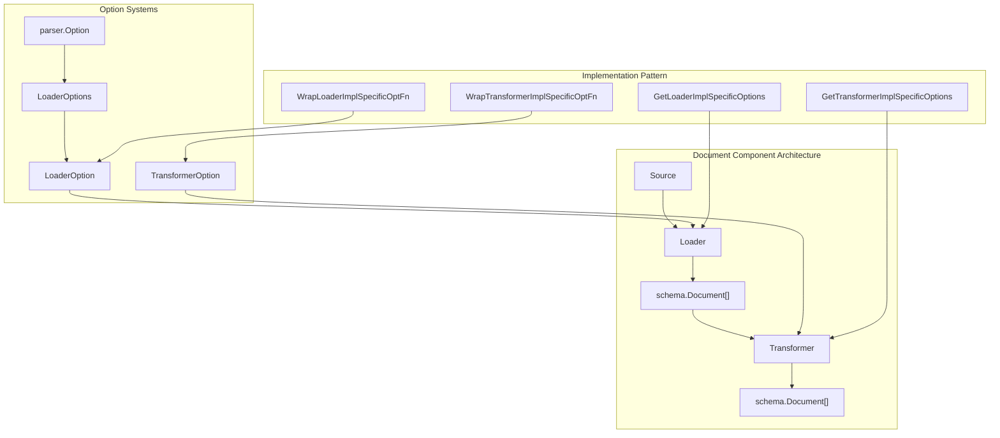
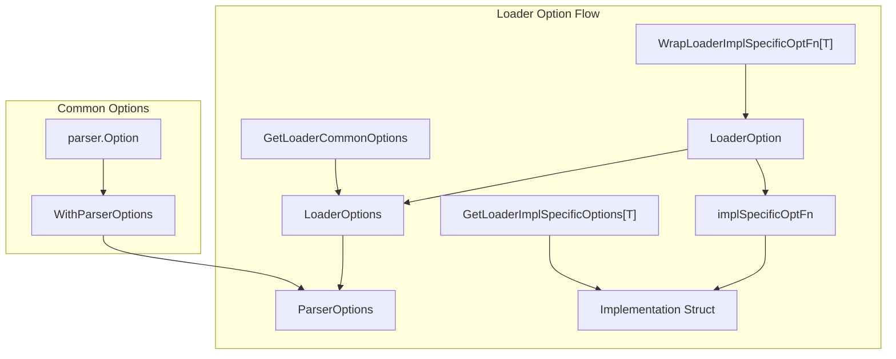
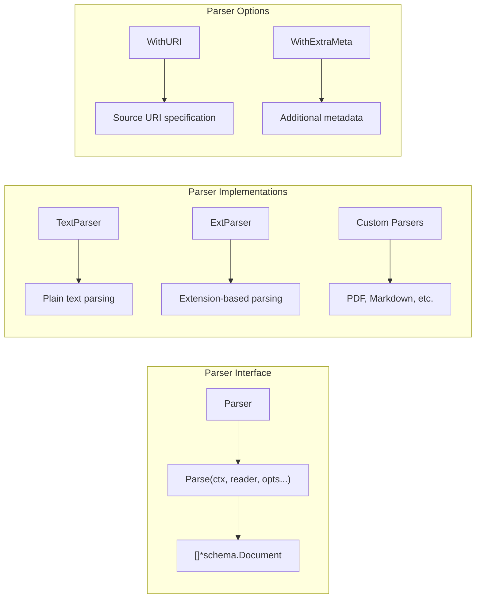

# 5.4 components文本语义处理类


## 一、document

document是Eino框架中负责文档加载和转换的核心组件系统，它提供了统一的接口抽象和灵活的配置选项，支持从各种源加载文档并进行转换处理。

**Loader**：加载文档。如读取本地或从url加载。[https://www.cloudwego.io/zh/docs/eino/core_modules/components/document_loader_guide/](https://www.cloudwego.io/zh/docs/eino/core_modules/components/document_loader_guide/)

**Parser：**解析文档。如根据文件扩展名解析不同格式的文档内容，为解析后的文档添加元数据。

**Transformer：**转换和处理文档。如分割、过滤、合并等。[https://www.cloudwego.io/zh/docs/eino/core_modules/components/document_transformer_guide/](https://www.cloudwego.io/zh/docs/eino/core_modules/components/document_transformer_guide/)


**核心架构设计:**



### **核心接口设计**

**Loader接口:** 

定义了文档加载的核心契约

```go
type Loader interface {
    Load(ctx context.Context, src Source, opts ...LoaderOption) ([]*schema.Document, error)
}
```

**设计特点：**

- **上下文支持**：使用context.Context支持取消和超时控制
- **源抽象**：通过Source结构体统一文档源表示
- **选项模式**：支持可变参数配置选项
- **批量返回**：返回文档切片，支持多文档加载


**Transformer接口：**

处理文档转换操作

```go
type Transformer interface {
    Transform(ctx context.Context, src []*schema.Document, opts ...TransformerOption) ([]*schema.Document, error)
}
```

**设计特点：**

- **批量处理**：输入和输出都是文档切片
- **链式转换**：支持多个转换器串联
- **选项配置**：每个转换器可以有自己的配置选项


### **选项系统架构**

**Loader选项系统:**



**核心设计模式：**

1. **通用选项**：LoaderOptions包含框架级别的配置
1. **实现特定选项**：通过泛型函数包装实现特定的选项
1. **类型安全**：使用Go泛型确保选项类型匹配
**选项包装函数:**

```go
func WrapLoaderImplSpecificOptFn[T any](optFn func(*T)) LoaderOption {
    return LoaderOption{
        implSpecificOptFn: optFn,
    }
}
```


### **Parser子系统**

Document组件包含一个完整的Parser子系统，支持不同格式的文档解析：



**ExtParser设计:**

```go
type customOptions struct {
    conf string
}

func WithConf(conf string) LoaderOption {
    return WrapLoaderImplSpecificOptFn(func(o *customOptions) {
        o.conf = conf
    })
}
```

**核心特性：**

- **扩展名路由**：使用filepath.Ext(uri)确定解析器
- **回退机制**：默认使用TextParser作为回退
- **元数据注入**：自动注入URI和额外元数据
- **解析器注册**：支持动态注册新的解析器


### **回调系统集成**


## 二、e**mbedding**

> [https://www.cloudwego.io/zh/docs/eino/core_modules/components/embedding_guide/](https://www.cloudwego.io/zh/docs/eino/core_modules/components/embedding_guide/)

一个用于将文本转换为向量表示的组件。主要作用是将文本内容映射到向量空间，使得语义相似的文本在向量空间中的距离较近。

应用场景：

- 文本相似度计算
- 语义搜索
- 文本聚类分析
### **核心接口设计 (interface.go)**

```go
type Embedder interface {
	EmbedStrings(ctx context.Context, texts []string, opts ...Option) ([][]float64, error) // invoke
}
```

**设计特点：**

- **简洁性**：只定义了一个核心方法，符合Go语言的"少即是多"哲学
- **上下文感知**：使用context.Context支持超时、取消等控制
- **批量处理**：支持一次处理多个文本，提高效率
- **选项模式**：通过可变参数opts支持灵活配置
- **类型安全**：返回[][]float64确保向量数据的类型安全
### **选项模式设计 (option.go)**

**基础选项结构**

```go
type Options struct {
	// Model is the model name for the embedding.
	Model *string
}
```

**选项构建器模式**

```go
func WithModel(model string) Option {
	return Option{
		apply: func(opts *Options) {
			opts.Model = &model
		},
	}
}
```

**泛型选项支持**

```go
func WrapImplSpecificOptFn[T any](optFn func(*T)) Option {
	return Option{
		implSpecificOptFn: optFn,
	}
}

func GetImplSpecificOptions[T any](base *T, opts ...Option) *T {
	if base == nil {
		base = new(T)
	}

	for i := range opts {
		opt := opts[i]
		if opt.implSpecificOptFn != nil {
			optFn, ok := opt.implSpecificOptFn.(func(*T))
			if ok {
				optFn(base)
			}
		}
	}

	return base
}
```

**设计亮点：**

- **函数式编程**：使用闭包实现选项的延迟应用
- **类型安全**：通过泛型支持实现特定的选项类型
- **默认值处理**：支持基础选项的默认值设置
- **链式调用**：可以组合多个选项
### **回调机制设计 (callback_extra.go)**

**回调数据结构**

```go
type ComponentExtra struct {
	// Config is the config for the embedding.
	Config *Config
	// TokenUsage is the token usage for the embedding.
	TokenUsage *TokenUsage
}

type CallbackInput struct {
	// Texts is the texts to be embedded.
	Texts []string
	// Config is the config for the embedding.
	Config *Config
	// Extra is the extra information for the callback.
	Extra map[string]any
}
```

**类型转换工具**

```go
func ConvCallbackInput(src callbacks.CallbackInput) *CallbackInput {
	switch t := src.(type) {
	case *CallbackInput:
		return t
	case []string:
		return &CallbackInput{
			Texts: t,
		}
	default:
		return nil
	}
}
```

**设计优势：**

- **类型转换**：支持多种输入类型的自动转换
- **扩展性**：通过Extra字段支持自定义数据
- **监控友好**：包含Token使用统计，便于成本控制
- **配置追踪**：记录完整的配置信息


## **三、indexer**

> [https://www.cloudwego.io/zh/docs/eino/core_modules/components/indexer_guide/](https://www.cloudwego.io/zh/docs/eino/core_modules/components/indexer_guide/)

一个用于存储和索引文档的组件。它的主要作用是将文档及其向量表示存储到后端存储系统中，并提供高效的检索能力。

应用场景：

- 构建向量数据库，以用于语义关联搜索
### **核心接口设计 (interface.go)**

```go
type Indexer interface {
	// Store stores the documents.
	Store(ctx context.Context, docs []*schema.Document, opts ...Option) (ids []string, err error) // invoke
}
```

**设计特点：**

- **文档存储**：专门负责文档的持久化存储
- **批量处理**：支持一次存储多个文档，提高效率
- **ID返回**：返回存储后的文档ID，便于后续检索
- **Schema集成**：与schema.Document紧密集成，确保类型安全
### **选项模式设计 (option.go)**

**基础选项结构**

```go
type Options struct {
	// SubIndexes is the sub indexes to be indexed.
	SubIndexes []string
	// Embedding is the embedding component.
	Embedding embedding.Embedder
}
```

**关键特性：**

- **子索引支持**：通过SubIndexes支持多级索引结构
- **Embedding集成**：直接集成embedding组件，实现向量化存储
**选项构建器:**

```go
func WithSubIndexes(subIndexes []string) Option {
	return Option{
		apply: func(opts *Options) {
			opts.SubIndexes = subIndexes
		},
	}
}

func WithEmbedding(emb embedding.Embedder) Option {
	return Option{
		apply: func(opts *Options) {
			opts.Embedding = emb
		},
	}
}
```

**设计亮点：**

- **组件组合**：通过选项模式实现embedding组件的注入
- **灵活配置**：支持子索引和向量化的灵活配置
### **回调机制设计 (callback_extra.go)**

**回调数据结构**

```go
type CallbackInput struct {
	// Docs is the documents to be indexed.
	Docs []*schema.Document
	// Extra is the extra information for the callback.
	Extra map[string]any
}

type CallbackOutput struct {
	// IDs is the ids of the indexed documents returned by the indexer.
	IDs []string
	// Extra is the extra information for the callback.
	Extra map[string]any
}
```

**类型转换工具**

```go
func ConvCallbackInput(src callbacks.CallbackInput) *CallbackInput {
	switch t := src.(type) {
	case *CallbackInput:
		return t
	case []*schema.Document:
		return &CallbackInput{
			Docs: t,
		}
	default:
		return nil
	}
}
```


## **四、retriever**

> [https://www.cloudwego.io/zh/docs/eino/core_modules/components/retriever_guide/](https://www.cloudwego.io/zh/docs/eino/core_modules/components/retriever_guide/)

一个用于从各种数据源检索文档的组件。

主要作用：根据用户的查询（query）从文档库中检索出最相关的文档。

应用场景：

- 基于向量相似度的文档检索
- 基于关键词的文档搜索
- 知识库问答系统 (rag)
### **核心接口设计 (interface.go)**

```go
type Retriever interface {
	Retrieve(ctx context.Context, query string, opts ...Option) ([]*schema.Document, error)
}
```


**设计特点：**

- **查询检索**：专门负责根据查询字符串检索相关文档
- **文档返回**：返回schema.Document列表，支持结构化数据
- **选项配置**：通过可变参数opts支持灵活的检索配置
- **上下文感知**：使用context.Context支持超时、取消等控制


### **选项模式设计 (option.go)**

**基础选项结构**

```go
type Options struct {
	// Index is the index for the retriever, index in different retriever may be different.
	Index *string
	// SubIndex is the sub index for the retriever, sub index in different retriever may be different.
	SubIndex *string
	// TopK is the top k for the retriever, which means the top number of documents to retrieve.
	TopK *int
	// ScoreThreshold is the score threshold for the retriever, eg 0.5 means the score of the document must be greater than 0.5.
	ScoreThreshold *float64
	// Embedding is the embedder for the retriever, which is used to embed the query for retrieval.
	Embedding embedding.Embedder
	// DSLInfo is the dsl info for the retriever, which is used to retrieve the documents from the retriever.
	DSLInfo map[string]interface{}
}
```

**关键特性：**

- **索引管理**：支持主索引和子索引的灵活配置
- **检索控制**：通过TopK和ScoreThreshold控制检索精度
- **向量化集成**：直接集成embedding组件，支持向量检索
- **DSL支持**：支持复杂的查询语言（如VikingDB）


**选项构建器**

```go
func WithIndex(index string) Option {
	return Option{
		apply: func(opts *Options) {
			opts.Index = &index
		},
	}
}

func WithTopK(topK int) Option {
	return Option{
		apply: func(opts *Options) {
			opts.TopK = &topK
		},
	}
}

func WithScoreThreshold(threshold float64) Option {
	return Option{
		apply: func(opts *Options) {
			opts.ScoreThreshold = &threshold
		},
	}
}

func WithEmbedding(emb embedding.Embedder) Option {
	return Option{
		apply: func(opts *Options) {
			opts.Embedding = emb
		},
	}
}
```


### **回调机制设计 (callback_extra.go)**

**回调数据结构**

```go
type CallbackInput struct {
	// Query is the query for the retriever.
	Query string
	// TopK is the top k for the retriever, which means the top number of documents to retrieve.
	TopK int
	// Filter is the filter for the retriever.
	Filter string
	// ScoreThreshold is the score threshold for the retriever, eg 0.5 means the score of the document must be greater than 0.5.
	ScoreThreshold *float64
	// Extra is the extra information for the retriever.
	Extra map[string]any
}

type CallbackOutput struct {
	// Docs is the documents for the retriever.
	Docs []*schema.Document
	// Extra is the extra information for the retriever.
	Extra map[string]any
}
```


