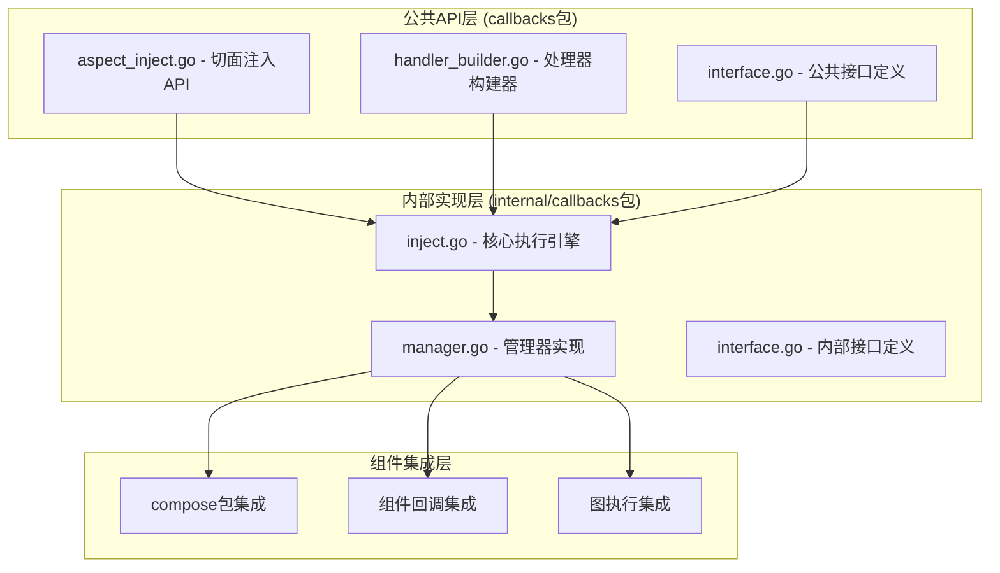
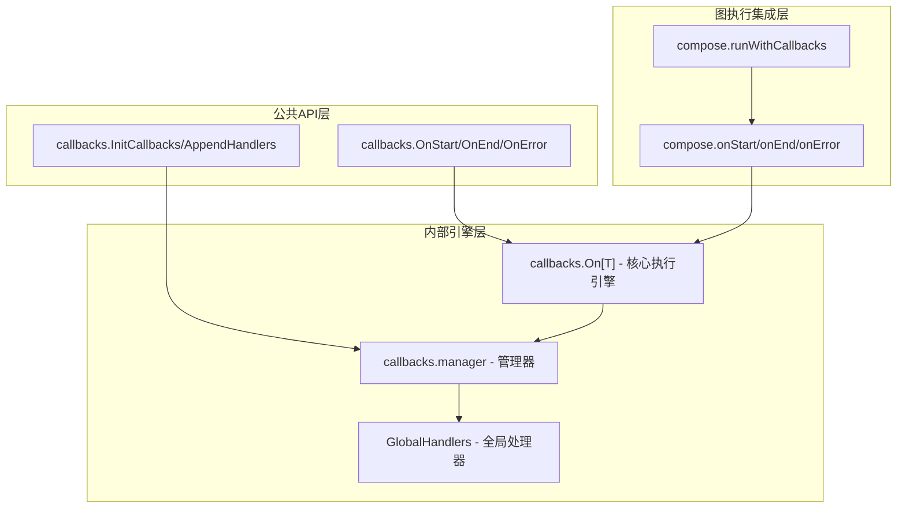
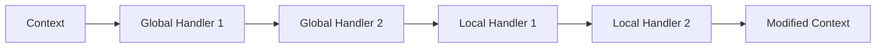

# 5.2 schema & callback

## 一、message

### 核心结构体

1. **Message 主结构体**
```go
type Message struct {
    Role    RoleType `json:"role"`           // 消息角色
    Content string   `json:"content"`        // 文本内容
    
    // 多模态内容（优先级高于Content）
    MultiContent []ChatMessagePart `json:"multi_content,omitempty"`
    
    Name string `json:"name,omitempty"`      // 消息名称
    
    // 助手消息的工具调用
    ToolCalls []ToolCall `json:"tool_calls,omitempty"`
    
    // 工具消息的标识
    ToolCallID string `json:"tool_call_id,omitempty"`
    ToolName   string `json:"tool_name,omitempty"`
    
    ResponseMeta *ResponseMeta `json:"response_meta,omitempty"`  // 响应元数据
    ReasoningContent string `json:"reasoning_content,omitempty"` // 推理过程
    
    Extra map[string]any `json:"extra,omitempty"`               // 扩展字段
}
```

1. **角色类型**
```go
// string枚举
type RoleType string

const (
    Assistant RoleType = "assistant"  // AI助手
    User      RoleType = "user"       // 用户
    System    RoleType = "system"     // 系统
    Tool      RoleType = "tool"       // 工具
)
```

```go
// uint8枚举
type FormatType uint8

const (
	FString FormatType = 0
	GoTemplate FormatType = 1
	Jinja2 FormatType = 2
)
```

**3. 多模态内容支持**

```go
type ChatMessagePart struct {
    Type ChatMessagePartType `json:"type,omitempty"`
    
    // 文本内容
    Text string `json:"text,omitempty"`
    
    // 多媒体内容
    ImageURL *ChatMessageImageURL `json:"image_url,omitempty"`
    AudioURL *ChatMessageAudioURL `json:"audio_url,omitempty"`
    VideoURL *ChatMessageVideoURL `json:"video_url,omitempty"`
    FileURL  *ChatMessageFileURL  `json:"file_url,omitempty"`
}
```

1. **MessageParser Message解析器**
```go
type MessageParser[T any] interface {
    Parse(ctx context.Context, m *Message) (T, error)
}


type MessageParseFrom string

const (
    MessageParseFromContent  MessageParseFrom = "content" // 从消息内容解析（如用户输入）
    MessageParseFromToolCall MessageParseFrom = "tool_call" // 从工具调用参数解析（如函数调用结果）
)
```

**路径提取机制：**

```go
// 使用 sonic 库进行高性能 JSON 解析，支持点分隔的路径表达式（如 "user.profile.name"）
// 一个速度奇快的 JSON 序列化/反序列化库，由 JIT （即时编译）和 SIMD （单指令流多数据流）加速。
// https://github.com/bytedance/sonic
func (p *MessageJSONParser[T]) extractData(data string) (string, error) {
    if p.ParseKeyPath == "" {
        return data, nil
    }
    
    keys := strings.Split(p.ParseKeyPath, ".")
    interfaceKeys := make([]interface{}, len(keys))
    for i, key := range keys {
        interfaceKeys[i] = key
    }
    
    node, err := sonic.GetFromString(data, interfaceKeys...)
    // ... 错误处理
}
```


### **核心功能特性**

**1. 消息模板系统**

```go
type MessagesTemplate interface {
    Format(ctx context.Context, vs map[string]any, formatType FormatType) ([]*Message, error)
}
```

支持三种模板引擎：

- **GoTemplate**：Go 标准模板
- **FString**：Python f-string 语法
- **Jinja2**：Jinja2 模板语法


**2. 流式消息拼接**

```go
func ConcatMessages(msgs []*Message) (*Message, error)
```

**核心算法逻辑**：

1. **一致性校验**：校验 Role、Name、ToolCallID 等字段的一致性
1. **内容合并**：使用 strings.Builder 高效合并文本内容
1. **工具调用合并**：根据 Index 字段合并 ToolCalls
1. **元数据聚合**：合并 ResponseMeta 中的使用统计信息
```go
msgs := []*Message{}
for {
	msg, err := stream.Recv()
	if errors.Is(err, io.EOF) {
		break
	}
	if err != nil {...}
	msgs = append(msgs, msg)
}

concatedMsg, err := ConcatMessages(msgs) // concatedMsg.Content will be full content of all messages
```


**3. 工具调用支持**

```go
type ToolCall struct {
    Index    *int         `json:"index,omitempty"`    // 流式合并索引
    ID       string       `json:"id"`                 // 工具调用ID
    Type     string       `json:"type"`               // 调用类型
    Function FunctionCall `json:"function"`           // 函数调用信息
    Extra    map[string]any `json:"extra,omitempty"` // 扩展信息
}
```

**messagesPlaceholder 占位符**

```go
type MessagesTemplate interface {
	Format(ctx context.Context, vs map[string]any, formatType FormatType) ([]*Message, error)
}

type messagesPlaceholder struct {
    key      string  // 在参数map中查找的键名
    optional bool    // 是否允许该占位符为空  fasle则必须存在否则error
}
```

**设计特点**：

- **最小化设计**：只包含必要的两个字段
- **不可变结构**：创建后字段值不可修改
- **语义清晰**：key 用于查找，optional 用于容错
**构造函数:**

```go
func MessagesPlaceholder(key string, optional bool) MessagesTemplate {
    return &messagesPlaceholder{
        key:      key,
        optional: optional,
    }
}
```

```go
// 简单粗暴的写法（如果确定 key 存在且类型正确）
// msgs := params["history"].([]*Message)

// msgs, err := placeholder.Format(ctx, params) 封装了错误处理的工具函数，也更安全
func (p *messagesPlaceholder) Format(_ context.Context, vs map[string]any, _ FormatType) ([]*Message, error) {
    // 1. 查找键值，排除键不存在
    v, ok := vs[p.key]
    if !ok {
        if p.optional {
            return []*Message{}, nil  // 可选占位符返回空列表
        }
        return nil, fmt.Errorf("message placeholder format: %s not found", p.key)
    }

    // 2. 类型断言，排除值的类型不匹配
    msgs, ok := v.([]*Message)
    if !ok {
        return nil, fmt.Errorf("only messages can be used to format message placeholder, key: %v, actual type: %v", p.key, reflect.TypeOf(v))
    }

    // 3. 返回消息列表
    return msgs, nil
}
```


**example：**

```go
placeholder := schema.MessagesPlaceholder("history", false)  // 创建占位符，map的key为"history"
params := map[string]any{
    "history": []*schema.Message{
        {Role: "user", Content: "what is eino?"}, 
        {Role: "assistant", Content: "eino is a great freamwork to build llm apps"}
    },
    "query": "how to use eino?",
}
msgs, err := placeholder.Format(ctx, params) //  执行格式化 <= this will return the value of "history" in params
// 执行结果：
// msgs = []*schema.Message{
//    {Role: "user", Content: "what is eino?"}, 
//    {Role: "assistant", Content: "eino is a great freamwork to build llm apps"}
// }
```


### **设计模式**

**1. 工厂模式**

```go
// 便捷的构造函数
func SystemMessage(content string) *Message // 系统消息
func UserMessage(content string) *Message  // 用户消息
func AssistantMessage(content string, toolCalls []ToolCall) *Message // AI助手消息
func ToolMessage(content string, toolCallID string, opts ...ToolMessageOption) *Message  // 工具消息
```

**2. 选项模式**

```go
type ToolMessageOption func(*toolMessageOptions)

func WithToolName(name string) ToolMessageOption {
    return func(o *toolMessageOptions) {
        o.toolName = name
    }
}
```

**3. 策略模式**

```go
// 根据FormatType选择不同的模板引擎
func formatContent(content string, vs map[string]any, formatType FormatType) (string, error) {
    switch formatType {
    case FString:
        return pyfmt.Fmt(content, vs)
    case GoTemplate:
        // Go模板处理
    case Jinja2:
        // Jinja2模板处理
    }
}
```


### example

```go
// eino/schema/message_test.go
// 测试要点：
// 多模板引擎支持：验证 FString、Jinja2、GoTemplate 三种格式
// 占位符功能：测试 MessagesPlaceholder 的正确插入
// 格式化一致性：确保不同模板引擎产生相同结果
func TestMessageTemplate(t *testing.T) {
    // 测试三种不同的模板格式
    pyFmtMessage := UserMessage("input: {question}")           // FString 格式
    jinja2Message := UserMessage("input: {{question}}")        // Jinja2 格式
    goTemplateMessage := UserMessage("input: {{.question}}")   // GoTemplate 格式
    
    ctx := context.Background()
    question := "what's the weather today"
    expected := []*Message{UserMessage("input: " + question)}

    // 测试 FString 格式化
    ms, err := pyFmtMessage.Format(ctx, map[string]any{"question": question}, FString)
    assert.Nil(t, err)
    assert.True(t, reflect.DeepEqual(expected, ms))
    
    // 测试 Jinja2 格式化
    ms, err = jinja2Message.Format(ctx, map[string]any{"question": question}, Jinja2)
    assert.Nil(t, err)
    assert.True(t, reflect.DeepEqual(expected, ms))
    
    // 测试 GoTemplate 格式化
    ms, err = goTemplateMessage.Format(ctx, map[string]any{"question": question}, GoTemplate)
    assert.Nil(t, err)
    assert.True(t, reflect.DeepEqual(expected, ms))

    // 测试 MessagesPlaceholder
    mp := MessagesPlaceholder("chat_history", false)
    m1 := UserMessage("how are you?")
    m2 := AssistantMessage("I'm good. how about you?", nil)
    ms, err = mp.Format(ctx, map[string]any{"chat_history": []*Message{m1, m2}}, FString)
    assert.Nil(t, err)
    
    // 验证占位符正确插入消息
    assert.Equal(t, 2, len(ms))
    assert.Equal(t, ms[0], m1)
    assert.Equal(t, ms[1], m2)
}


```

```go
// eino-examples/quickstart/chat/main.go

```


## 二、stream

918行的大go文件

### 核心结构体

**stream底层实现：chan**

```go
type stream[T any] struct {
    **items chan streamItem[T]  // 核心：带缓冲的 channel**
    closed chan struct{}      // **关闭信号 channel**
    automaticClose bool       // 自动关闭标志
    closedFlag *uint32        // 原子关闭标志
}

type streamItem[T any] struct {
    chunk T      // 数据块
    err   error  // 错误信息
}
```


**对比LangGraph：基于 Pregel 运行时引擎的流式处理**

*Pregel 是 Google 在 2010 年发表的一篇论文中提出的****图计算系统****，基于 Bulk Synchronous Parallel 计算模型*

```python
class Pregel:
    def stream(self, input_data, stream_mode=["values"]):
        # 使用 StreamProtocol 处理流式输出
        stream_protocol = StreamProtocol(stream_mode)
        
        # 通过 PregelLoop 执行
        if self.is_async:
            loop = AsyncPregelLoop(stream_protocol)
        else:
            loop = SyncPregelLoop(stream_protocol)
        
        return loop.execute(input_data)

class StreamProtocol:
    def __call__(self, stream_chunk):
        # 处理不同类型的流数据块
        # 支持多种 stream_mode：values, updates, custom, messages, checkpoints, tasks
        pass
```


**StreamWriter 接口:**

```go
type StreamWriter[T any] struct {
    stm *stream[T]
}

func (sw *StreamWriter[T]) Send(chunk T, err error) (closed bool)  // 返回 closed 布尔值，让发送方知道流是否已关闭
func (sw *StreamWriter[T]) Close()
```

**StreamReader 接口:**

```go
type StreamReader[T any] struct {
    typ readerType   // 多态设计：通过 readerType 字段区分不同的底层实
    st  *stream[T]
    ar  *arrayReader[T]
    msr *multiStreamReader[T]
    srw *streamReaderWithConvert[T]
    csr *childStreamReader[T]
}
```

**流类型系统:**

```go
type readerType int

const (
    readerTypeStream        readerType = iota  // 基础流
    readerTypeArray                            // 数组流
    readerTypeMultiStream                      // 多流合并
    readerTypeWithConvert                      // 类型转换流
    readerTypeChild                            // 子流（复制）
)
```


### 核心功能特性

**Pipe 函数 - 流的创建**

```go
func Pipe[T any](cap int) (*StreamReader[T], *StreamWriter[T]) {
    stm := newStream[T](cap) // 支持缓冲区容量配置，平衡内存使用和性能
    return stm.asReader(), &StreamWriter[T]{stm: stm} // 返回一对读写器
}
```


**流复制 (Copy)：**

使用场景：

- 数据广播：一个流分发给多个消费者
- 并行处理：多个 goroutine 同时处理同一数据流
- 数据备份：创建流的多个副本用于不同目的
```go
func (sr *StreamReader[T]) Copy(n int) []*StreamReader[T] {
    if n < 2 {
        return []*StreamReader[T]{sr}
    }
    
    if sr.typ == readerTypeArray {
        // 数组流的快速复制
        ret := make([]*StreamReader[T], n)
        for i, ar := range sr.ar.copy(n) {
            ret[i] = &StreamReader[T]{typ: readerTypeArray, ar: ar}
        }
        return ret
    }
    
    return copyStreamReaders[T](sr, n)
}
```

**流合并 (Merge):**

```go
func MergeStreamReaders[T any](srs []*StreamReader[T]) *StreamReader[T] {
    if len(srs) < 1 {
        return nil
    }
    
    if len(srs) < 2 {
        return srs[0]
    }
    
    // 智能合并策略
    var arr []T
    var ss []*stream[T]
    
    for _, sr := range srs {
        switch sr.typ {
        case readerTypeStream:
            ss = append(ss, sr.st)
        case readerTypeArray:
            arr = append(arr, sr.ar.arr[sr.ar.index:]...)
        // ... 其他类型处理
        }
    }
    
    // 根据内容类型选择最优合并策略
    if len(ss) == 0 {
        return &StreamReader[T]{typ: readerTypeArray, ar: &arrayReader[T]{arr: arr, index: 0}}
    }
    
    return &StreamReader[T]{typ: readerTypeMultiStream, msr: newMultiStreamReader(ss)}
}
```

**类型转换流：**

**应用场景**：

- 数据格式转换：如 JSON 字符串转结构化数据
- 数据过滤：使用 ErrNoValue 跳过特定数据
- 类型适配：连接不同类型的流组件
```go
func StreamReaderWithConvert[T, D any](sr *StreamReader[T], convert func(T) (D, error)) *StreamReader[D] {
    c := func(a any) (D, error) {
        return convert(a.(T))
    }
    
    return newStreamReaderWithConvert(sr, c)
}
```


### 性能优化设计

- 使用原子操作避免竞态条件
- 支持自动关闭机制，减少手动资源管理
```go
func (s *stream[T]) closeRecv() {
    if s.automaticClose {
        if atomic.CompareAndSwapUint32(s.closedFlag, 0, 1) {
            close(s.closed)
        }
        return
    }
    
    close(s.closed)
}
```

- 小数量使用优化算法，大数量使用反射
```go
func (msr *multiStreamReader[T]) recv() (T, error) {
    if len(msr.nonClosed) > maxSelectNum {
        // 使用反射进行多路选择
        var chosen int
        var recv reflect.Value
        chosen, recv, ok = reflect.Select(msr.itemsCases)
        // ...
    } else {
        // 使用优化的接收逻辑
        chosen, item, ok = receiveN(msr.nonClosed, msr.sts)
    }
}
```


## 三、tool

### **核心结构体**

**1. ToolInfo - 工具的元数据，让LLM能理解这个工具**

```go
type ToolInfo struct {
    Name        string                 // 工具唯一标识
    Desc        string                 // 工具描述和用法指导
    Extra       map[string]any         // 扩展元数据
    ***ParamsOneOf**                      // 参数定义（联合类型）
}
```

**ParamsOneOf - 参数定义联合类型：**

**确保用户只能选择一种参数定义的方法**：params、openAPIV3小写开头，包外不能访问，引导到只能使用工厂函数/构造函数，工厂函数确保params、openAPIV3中的一种（另一种默认初始化为零值），在运行时再通过ToOpenAPIV3()方法统一转换为标准格式。

**OpenAPI：****用于描述和定义RESTful API的接口。（类似IDL）**

- **前身**：Swagger（由SmartBear公司开发），**2014年发布，即OpenAPI v2**
- **2015年**：Swagger项目捐赠给OpenAPI Initiative（Linux基金会）
- **2017年**：发布OpenAPI 3.0规范
```go
type ParamsOneOf struct {
    params    map[string]***ParameterInfo**  // **ParameterInfo：Eino封装的简洁参数定义方式**
    openAPIV3 ***openapi3.Schema**          // **业界标准OpenAPI接口描述标准规范**
}
```

ParamsOneOf结构体对应的工厂函数（**互斥性**）：

```go
// NewParamsOneOfByParams creates a ParamsOneOf with map[string]*ParameterInfo.
func NewParamsOneOfByParams(params map[string]*ParameterInfo) *ParamsOneOf {
	return &ParamsOneOf{
		params: params,
	}
}

// NewParamsOneOfByOpenAPIV3 creates a ParamsOneOf with *openapi3.Schema.
func NewParamsOneOfByOpenAPIV3(openAPIV3 *openapi3.Schema) *ParamsOneOf {
	return &ParamsOneOf{
		openAPIV3: openAPIV3,
	}
}

func (p *ParamsOneOf) ToOpenAPIV3() (*openapi3.Schema, error) {
    if p.params != nil {
        // 将ParameterInfo转换为OpenAPI Schema
        return convertParamsToSchema(p.params)
    }
    return p.openAPIV3, nil
}
```

**ParameterInfo - 参数信息：**

```go
type ParameterInfo struct {
    Type       **DataType**                    // 参数类型
    Desc       string                     // 参数描述
    ElemInfo   *ParameterInfo             // **数组元素类型（递归设计）**
    SubParams  map[string]*ParameterInfo  // **对象子参数（递归设计）**
    Enum       []string                   // 枚举值
    Required   bool                       // 是否必需
}
```

**DataType - 数据类型枚举：**OpenAPI v3.0标准的数据类型映射

```go
type DataType string

const (
    **Object**  DataType = "object"
    Number  DataType = "number"
    Integer DataType = "integer"
    String  DataType = "string"
    Array   DataType = "array"
    Null    DataType = "null"  // Null为类型。 javascript中的设计bug，null既是值也是类型：typeof null; // "object"
    Boolean DataType = "boolean"
)
```

**2. ToolChoice - 工具调用控制**

```go
type ToolChoice string

const (
    ToolChoiceForbidden ToolChoice = "forbidden"  // 禁止调用工具
    ToolChoiceAllowed   ToolChoice = "allowed"    // 允许选择是否调用工具
    ToolChoiceForced    ToolChoice = "forced"     // 强制调用工具
)
```

### 核心功能特性

**递归类型转换:**

```go
func paramInfoToJSONSchema(paramInfo *ParameterInfo) *openapi3.SchemaRef {
    // 处理基本类型
    // 递归处理数组元素
    if paramInfo.ElemInfo != nil {
        js.Value.Items = paramInfoToJSONSchema(paramInfo.ElemInfo)
    }
    // 递归处理对象子参数
    if len(paramInfo.SubParams) > 0 {
        for k, v := range paramInfo.SubParams {
            js.Value.Properties[k] = paramInfoToJSONSchema(v)
        }
    }
}
```


**双重参数定义策略：**

```go
// 方式1：直观的参数定义
params := map[string]*ParameterInfo{
    "query": {
        Type: String,
        Desc: "搜索查询",
        Required: true,
    },
}

// 方式2：标准OpenAPI v3.0
openAPISchema := &openapi3.Schema{...}
```


### example

ParameterInfo:

```go
toolInfo := &schema.ToolInfo{
    Name: "get_weather",
    Desc: "获取指定城市的天气信息",
    ParamsOneOf: schema.NewParamsOneOfByParams(map[string]*schema.ParameterInfo{
        "city": {
            Type: String,
            Desc: "城市名称",
            Required: true,
        },
    }),
}

toolInfo := &schema.ToolInfo{
    Name: "analyze_data",
    Desc: "分析结构化数据",
    ParamsOneOf: schema.NewParamsOneOfByParams(map[string]*schema.ParameterInfo{
        "data": {
            Type: Object,
            Desc: "要分析的数据",
            SubParams: map[string]*schema.ParameterInfo{
                "fields": {
                    Type: Array,
                    Desc: "字段列表",
                    ElemInfo: &schema.ParameterInfo{
                        Type: String,
                        Desc: "字段名",
                    },
                },
            },
            Required: true,
        },
    }),
}
```

openapi3.Schema:

```go
openAPISchema := &openapi3.Schema{
    Type: openapi3.TypeObject,
    Required: []string{"name", "age"},
    Properties: map[string]*openapi3.SchemaRef{
        "name": {
            Value: &openapi3.Schema{
                Type:        openapi3.TypeString,
                Description: "用户姓名",
                MinLength:   &[]int{1}[0],
                MaxLength:   &[]int{50}[0],
            },
        },
        "age": {
            Value: &openapi3.Schema{
                Type:        openapi3.TypeInteger,
                Description: "用户年龄",
                Minimum:     &[]float64{0}[0],
                Maximum:     &[]float64{150}[0],
            },
        },
        "job": {
            Value: &openapi3.Schema{
                Type:        openapi3.TypeObject,
                Description: "工作信息",
                Properties: map[string]*openapi3.SchemaRef{
                    "company": {
                        Value: &openapi3.Schema{
                            Type:        openapi3.TypeString,
                            Description: "公司名称",
                        },
                    },
                    "position": {
                        Value: &openapi3.Schema{
                            Type:        openapi3.TypeString,
                            Description: "职位",
                        },
                    },
                },
            },
        },
    },
}

toolInfo := &schema.ToolInfo{
    Name: "search_user",
    Desc: "搜索用户信息",
    ParamsOneOf: schema.NewParamsOneOfByOpenAPIV3(openAPISchema),
}
```


## 四、document

### 核心结构体

```go
// 处理文档
type Document struct {
    ID       string         `json:"id"`        // 文档唯一标识
    Content  string         `json:"content"`   // 文档内容
    MetaData map[string]any `json:"meta_data"` // **元数据（map灵活扩展）**
}
```

**元数据：描述数据的数据**。类比书的封面、目录。

example:

```go
// 创建文档
doc := &Document{
    ID:      "doc_001",
    Content: "这是一篇关于人工智能的文章，介绍了机器学习的基本概念...",
    MetaData: map[string]any{
        // 这些就是元数据
        "_score":        0.95,                    // 文档质量评分
        "_sub_indexes":  []string{"AI", "ML"},   // 文档分类标签
        "_extra_info":   "已通过AI审核",           // 处理状态信息
        "author":        "张三",                  // 作者信息
        "create_time":   "2024-01-01",           // 创建时间
        "file_size":     1024,                   // 文件大小
        "language":      "zh-CN",                // 语言
    },
}
```


**元数据键常量**

```go
// 前缀_表示系统级元数据
const (
    docMetaDataKeySubIndexes   = "_sub_indexes"    // 子索引
    docMetaDataKeyScore        = "_score"          // 评分
    docMetaDataKeyExtraInfo    = "_extra_info"     // 额外信息
    docMetaDataKeyDSL          = "_dsl"            // 领域特定语言
    docMetaDataKeyDenseVector  = "_dense_vector"   // 密集向量
    docMetaDataKeySparseVector = "_sparse_vector"  // 稀疏向量
)
```


### 核心功能特性

链式调用设计：

```go
// 设置子索引
func (d *Document) WithSubIndexes(indexes []string) *Document {
    if d.MetaData == nil {
        d.MetaData = make(map[string]any)
    }
    d.MetaData[docMetaDataKeySubIndexes] = indexes
    return d  // **返回自身，支持链式调用**
}

// 使用示例
doc := &Document{Content: "Hello World"}
doc.WithSubIndexes([]string{"index1", "index2"}).
    WithScore(0.95).
    WithExtraInfo("processed by AI")
```

类型安全的访问器:

```go
// 获取子索引
func (d *Document) SubIndexes() []string {
    if d.MetaData == nil {
        return nil
    }
    
    indexes, ok := d.MetaData[docMetaDataKeySubIndexes].([]string)
    if ok {
        return indexes
    }
    return nil
}
```


**向量表示系统:**

**1. 密集向量（Dense Vector）,**应用场景：文本嵌入向量、语义搜索和相似度计算、向量数据库存储

```go
// 设置密集向量
func (d *Document) WithDenseVector(vector []float64) *Document {
    if d.MetaData == nil {
        d.MetaData = make(map[string]any)
    }
    d.MetaData[docMetaDataKeyDenseVector] = vector
    return d
}

// 获取密集向量
func (d *Document) DenseVector() []float64 {
    if d.MetaData == nil {
        return nil
    }
    
    vector, ok := d.MetaData[docMetaDataKeyDenseVector].([]float64)
    if ok {
        return vector
    }
    return nil
}
```

1. **稀疏向量（Sparse Vector）**
节省存储空间，与密集向量互补。适合TF-IDF、BM25等传统信息检索方法

```go
// 设置稀疏向量，key indices -> value vector
func (d *Document) WithSparseVector(sparse map[int]float64) *Document {
    if d.MetaData == nil {
        d.MetaData = make(map[string]any)
    }
    d.MetaData[docMetaDataKeySparseVector] = sparse
    return d
}
```


**搜索和索引支持：**

**1. 子索引系统**

```go
// 子索引用于分层搜索
func (d *Document) WithSubIndexes(indexes []string) *Document {
    if d.MetaData == nil {
        d.MetaData = make(map[string]any)
    }
    d.MetaData[docMetaDataKeySubIndexes] = indexes
    return d
}
```

**2. 评分系统**

```go
// 设置文档评分
func (d *Document) WithScore(score float64) *Document {
    if d.MetaData == nil {
        d.MetaData = make(map[string]any)
    }
    d.MetaData[docMetaDataKeyScore] = score
    return d
}
```


**DSL和扩展信息:**

**1. DSL信息**

```go
// 设置领域特定语言信息
func (d *Document) WithDSLInfo(dslInfo map[string]any) *Document {
    if d.MetaData == nil {
        d.MetaData = make(map[string]any)
    }
    d.MetaData[docMetaDataKeyDSL] = dslInfo
    return d
}
```

1. 拓展信息
```go
// 设置额外信息
func (d *Document) WithExtraInfo(extraInfo string) *Document {
    if d.MetaData == nil {
        d.MetaData = make(map[string]any)
    }
    d.MetaData[docMetaDataKeyExtraInfo] = extraInfo
    return d
}
```

### example

**1. 文档加载和解析**

```go
// 创建文档并设置元数据
doc := &Document{
    ID:      "doc_001",
    Content: "这是一篇关于AI的文章",
}

// 设置丰富的元数据
doc.WithSubIndexes([]string{"AI", "技术", "文章"}).
    WithScore(0.92).
    WithExtraInfo("已通过AI审核").
    WithDSLInfo(map[string]any{
        "category": "technology",
        "language": "zh-CN",
        "tags":     []string{"AI", "机器学习"},
    })
```

1. **向量化处理**
```go
// 设置密集向量（如BERT嵌入）
denseVector := []float64{0.1, 0.2, 0.3, 0.4, 0.5}
doc.WithDenseVector(denseVector)

// 设置稀疏向量（如TF-IDF）
sparseVector := map[int]float64{
    0: 0.8,   // "AI"的TF-IDF值
    1: 0.6,   // "技术"的TF-IDF值
    2: 0.4,   // "文章"的TF-IDF值
}
doc.WithSparseVector(sparseVector)
```

1. **搜索和检索**
```go
// 根据评分排序
if doc.Score() > 0.9 {
    // 高相关性文档
}

// 根据子索引过滤
subIndexes := doc.SubIndexes()
if contains(subIndexes, "AI") {
    // AI相关文档
}

// 向量相似度搜索
denseVector := doc.DenseVector()
if denseVector != nil {
    // 使用密集向量进行语义搜索
}
```

## 五、select

**多通道选择器：**

```go
func receiveN[T any](chosenList []int, ss []*stream[T]) (int, *streamItem[T], bool)
```

**函数切片索引**：

**工作原理**：

1. 根据len(chosenList)确定需要处理多少个通道；
1. 从函数切片中选择对应的处理函数；
1. 调用选中的函数执行实际的select操作；
```go
return []func(chosenList []int, ss []*stream[T]) (int, *streamItem[T], bool){
    nil,  // 索引0：空函数
    // 索引1：处理1个通道的select
    // 索引2：处理2个通道的select
    // 索引3：处理3个通道的select
    // 索引4：处理4个通道的select
    // 索引5：处理5个通道的select
}[len(chosenList)](chosenList, ss)
```


## 六、callbacks

> [https://www.cloudwego.io/zh/docs/eino/core_modules/chain_and_graph_orchestration/callback_manual/](https://www.cloudwego.io/zh/docs/eino/core_modules/chain_and_graph_orchestration/callback_manual/)

> Eino **Callback 用户手册**：[https://www.cloudwego.io/zh/docs/eino/core_modules/chain_and_graph_orchestration/callback_manual/](https://www.cloudwego.io/zh/docs/eino/core_modules/chain_and_graph_orchestration/callback_manual/)

> **Eino CallOption 能力与规范**：[https://www.cloudwego.io/zh/docs/eino/core_modules/chain_and_graph_orchestration/call_option_capabilities/](https://www.cloudwego.io/zh/docs/eino/core_modules/chain_and_graph_orchestration/call_option_capabilities/)


> eino/internal/callbacks
eino/callbacks

### **整体架构层次结构**

Eino的回调系统采用了**切面注入(Aspect Injection)**的设计模式，通过上下文(Context)机制实现跨组件的监控、日志记录、性能追踪等功能。




整个系统分为三个层次：




### 核心结构体/接口定义

**Handler接口体系**


```go
// 公共接口层 (callbacks/interface.go)
type Handler = callbacks.Handler

// 内部接口层 (internal/callbacks/interface.go)
type Handler interface {
    OnStart(ctx context.Context, info *RunInfo, input CallbackInput) context.Context
    OnEnd(ctx context.Context, info *RunInfo, output CallbackOutput) context.Context
    OnError(ctx context.Context, info *RunInfo, err error) context.Context
    OnStartWithStreamInput(ctx context.Context, info *RunInfo, 
        input *schema.StreamReader[CallbackInput]) context.Context
    OnEndWithStreamOutput(ctx context.Context, info *RunInfo, 
        output *schema.StreamReader[CallbackOutput]) context.Context
}
```

**设计亮点**：

- **类型别名**: 使用type Handler = callbacks.Handler实现接口透明转发
- **流式支持**: 完整的流式输入输出回调支持
- **上下文传播**: 所有回调都返回修改后的上下文


**TimingChecker接口:**

```go
// 公共接口层 (callbacks/interface.go)
type TimingChecker = callbacks.TimingChecker

// 内部接口层 (internal/callbacks/interface.go)
type TimingChecker interface {
	Needed(ctx context.Context, info *RunInfo, timing CallbackTiming) bool
}

const (
    TimingOnStart CallbackTiming = iota
    TimingOnEnd
    TimingOnError
    TimingOnStartWithStreamInput
    TimingOnEndWithStreamOutput
)
```

**时序控制机制**：

- **智能过滤**: 处理器可以根据时序和上下文决定是否执行
- **性能优化**: 避免不必要的回调执行
- **灵活控制**: 支持细粒度的执行控制


### **切面注入API设计**

**核心切面函数:**

```go
// aspect_inject.go - 主要切面注入API
func OnStart[T any](ctx context.Context, input T) context.Context
func OnEnd[T any](ctx context.Context, output T) context.Context
func OnError(ctx context.Context, err error) context.Context
func OnStartWithStreamInput[T any](ctx context.Context, input *schema.StreamReader[T]) (context.Context, *schema.StreamReader[T])
func OnEndWithStreamOutput[T any](ctx context.Context, output *schema.StreamReader[T]) (context.Context, *schema.StreamReader[T])
```

**设计特点**：

- **泛型支持**: 使用[T any]支持任意类型
- **流式集成**: 完整的流式处理支持
- **类型安全**: 编译时类型检查
**上下文管理API:**

```go
// aspect_inject.go - 主要切面注入API
func OnStart[T any](ctx context.Context, input T) context.Context
func OnEnd[T any](ctx context.Context, output T) context.Context
func OnError(ctx context.Context, err error) context.Context
func OnStartWithStreamInput[T any](ctx context.Context, input *schema.StreamReader[T]) (context.Context, *schema.StreamReader[T])
func OnEndWithStreamOutput[T any](ctx context.Context, output *schema.StreamReader[T]) (context.Context, *schema.StreamReader[T])
```


### **处理器构建器模式**

**HandlerBuilder**

```go
func EnsureRunInfo(ctx context.Context, typ string, comp components.Component) context.Context
func ReuseHandlers(ctx context.Context, info *RunInfo) context.Context
func InitCallbacks(ctx context.Context, info *RunInfo, handlers ...Handler) context.Context
```

**构建器模式优势**：

- **链式调用**: 支持流畅的API调用
- **可选配置**: 只设置需要的回调函数
- **类型安全**: 编译时确保函数签名正确


**构建器使用示例:**

```go
type HandlerBuilder struct {
    onStartFn                func(ctx context.Context, info *RunInfo, input CallbackInput) context.Context
    onEndFn                  func(ctx context.Context, info *RunInfo, output CallbackOutput) context.Context
    onErrorFn                func(ctx context.Context, info *RunInfo, err error) context.Context
    onStartWithStreamInputFn func(ctx context.Context, info *RunInfo, input *schema.StreamReader[CallbackInput]) context.Context
    onEndWithStreamOutputFn  func(ctx context.Context, info *RunInfo, output *schema.StreamReader[CallbackOutput]) context.Context
}
```

### **内部执行引擎分析**

**核心执行函数:**

```go
handler := callbacks.NewHandlerBuilder().
    OnStartFn(func(ctx context.Context, info *callbacks.RunInfo, input callbacks.CallbackInput) context.Context {
        log.Printf("Starting %s of type %s", info.Name, info.Type)
        return ctx
    }).
    OnEndFn(func(ctx context.Context, info *callbacks.RunInfo, output callbacks.CallbackOutput) context.Context {
        log.Printf("Completed %s", info.Name)
        return ctx
    }).
    OnErrorFn(func(ctx context.Context, info *callbacks.RunInfo, err error) context.Context {
        log.Printf("Error in %s: %v", info.Name, err)
        return ctx
    }).
    Build()
```

**执行引擎特点**：

- **统一入口**: 所有回调都通过这个函数执行
- **时序控制**: 通过start参数控制处理器执行顺序
- **智能过滤**: 结合TimingChecker实现条件执行


**处理器执行顺序:**

- **OnStart**: 最内层处理器最先执行，**适合资源初始化**
- **OnEnd**: 最外层处理器最先执行，**适合资源清理**


### **管理器架构设计**

**manager结构体:**

```go
// OnStart处理器按逆序执行（后进先出）
func OnStartHandle[T any](ctx context.Context, input T,
    runInfo *RunInfo, handlers []Handler) (context.Context, T) {
    for i := len(handlers) - 1; i >= 0; i-- {
        ctx = handlers[i].OnStart(ctx, runInfo, input)
    }
    return ctx, input
}

// OnEnd处理器按正序执行（先进先出）
func OnEndHandle[T any](ctx context.Context, output T,
    runInfo *RunInfo, handlers []Handler) (context.Context, T) {
    for _, handler := range handlers {
        ctx = handler.OnEnd(ctx, runInfo, output)
    }
    return ctx, output
}
```

**分层管理策略**：

- **GlobalHandlers**: 框架级别的全局处理器，影响所有组件
- **handlers**: 组件特定的本地处理器
- **runInfo**: 当前执行上下文信息


**管理器生命周期:**

```go
type manager struct {
    globalHandlers []Handler    // 全局处理器列表
    handlers       []Handler    // 本地处理器列表
    runInfo        *RunInfo     // 运行时信息
}

var GlobalHandlers []Handler   // 包级全局处理器
```

**生命周期管理**：

- **创建**: 根据运行时信息和处理器创建管理器
- **注入**: 将管理器注入到上下文中
- **提取**: 从上下文中提取管理器实例


### **流式处理集成**

**流式回调处理:**

```go
func newManager(runInfo *RunInfo, handlers ...Handler) (*manager, bool)
func ctxWithManager(ctx context.Context, manager *manager) context.Context
func managerFromCtx(ctx context.Context) (*manager, bool)
```

**流式处理核心**：

- **流复制**: 为每个处理器创建独立的流副本
- **并行处理**: 支持多个处理器同时处理流数据
- **资源管理**: 确保流的正确关闭和清理


**流转换器:**

```go
func OnWithStreamHandle[S any](ctx context.Context, inOut S, 
    handlers []Handler, cpy func(int) []S, 
    handle func(context.Context, Handler, S) context.Context) (context.Context, S)
```


**类型安全转换**：

- **泛型支持**: 保持类型安全
- **接口适配**: 将类型化流转换为通用接口
- **资源管理**: 确保流的正确生命周期管理


### **全局处理器管理**

**全局处理器API**

```go
func OnStartWithStreamInputHandle[T any](ctx context.Context, 
    input *schema.StreamReader[T], runInfo *RunInfo, 
    handlers []Handler) (context.Context, *schema.StreamReader[T])
```

**全局处理器策略**：

- **初始化**: 完全替换现有全局处理器
- **追加**: 保留现有处理器，追加新的处理器
- **执行顺序**: 全局处理器在用户特定处理器之前执行


**处理器组合逻辑:**

```go
// 追加全局处理器（推荐）
func AppendGlobalHandlers(handlers ...Handler)
```


### **实际应用场景**

**性能监控处理器:**

```go
hs := make([]Handler, 0, len(nMgr.handlers)+len(nMgr.globalHandlers))
for _, handler := range append(nMgr.handlers, nMgr.globalHandlers...) {
    timingChecker, ok_ := handler.(TimingChecker)
    if !ok_ || timingChecker.Needed(ctx, info, timing) {
        hs = append(hs, handler)
    }
}
```

**日志记录处理器:**

```go
handler := callbacks.NewHandlerBuilder().
    OnStartFn(func(ctx context.Context, info *callbacks.RunInfo, input callbacks.CallbackInput) context.Context {
        start := time.Now()
        return context.WithValue(ctx, "startTime", start)
    }).
    OnEndFn(func(ctx context.Context, info *callbacks.RunInfo, output callbacks.CallbackOutput) context.Context {
        if start, ok := ctx.Value("startTime").(time.Time); ok {
            duration := time.Since(start)
            metrics.RecordDuration(info.Type, info.Name, duration)
        }
        return ctx
    }).
    Build()

callbacks.AppendGlobalHandlers(handler)
```


**组件集成示例:**

```go
handler := callbacks.NewHandlerBuilder().
    OnStartFn(func(ctx context.Context, info *callbacks.RunInfo, input callbacks.CallbackInput) context.Context {
        log.Printf("[START] Component: %s, Type: %s", info.Name, info.Type)
        return ctx
    }).
    OnEndFn(func(ctx context.Context, info *callbacks.RunInfo, output callbacks.CallbackOutput) context.Context {
        log.Printf("[END] Component: %s completed successfully", info.Name)
        return ctx
    }).
    OnErrorFn(func(ctx context.Context, info *callbacks.RunInfo, err error) context.Context {
        log.Printf("[ERROR] Component: %s failed: %v", info.Name, err)
        return ctx
    }).
    Build()
```


### 设计模式

**切面编程模式 (AOP):**

- **横切关注点**: 日志、监控、性能追踪等
- **非侵入性**: 不修改原有业务逻辑
- **可组合性**: 支持多个切面的组合


**责任链模式:**

处理器列表形成了**责任链模式**：每个处理器都可以修改上下文，影响后续处理器的行为。




**构建器模式:**

```go
func (t *testChatModel) Generate(ctx context.Context, input []*schema.Message, opts ...model.Option) (resp *schema.Message, err error) {
    defer func() {
        if err != nil {
            callbacks.OnError(ctx, err)
        }
    }()

    ctx = callbacks.OnStart(ctx, &model.CallbackInput{
        Messages: input,
        Tools:    nil,
        Extra:    nil,
    })

    // 组件业务逻辑...

    ctx = callbacks.OnEnd(ctx, &model.CallbackOutput{
        Message: resp,
        Extra:   nil,
    })

    return resp, nil
}
```

**构建器模式优势**：

- **链式调用**: 支持流畅的API调用
- **可选配置**: 只设置需要的回调函数
- **类型安全**: 编译时确保函数签名正确


### **性能优化特性**

**智能处理器过滤：**通过TimingChecker接口实现智能过滤，避免不必要的处理器执行。


**内存复用和隔离:**通过值复制而非指针共享，确保线程安全和内存隔离。

```go
handler := callbacks.NewHandlerBuilder().
    OnStartFn(startFn).
    OnEndFn(endFn).
    OnErrorFn(errorFn).
    Build()
```

**上下文隔离:**每个上下文都有独立的管理器实例，确保并发安全。

```go
func ctxWithManager(ctx context.Context, manager *manager) context.Context {
    return context.WithValue(ctx, CtxManagerKey{}, manager)
}
```

**处理器执行优化：**避免不必要的循环和函数调用。

```go
for _, handler := range append(nMgr.handlers, nMgr.globalHandlers...) {
    timingChecker, ok_ := handler.(TimingChecker)
    if !ok_ || timingChecker.Needed(ctx, info, timing) {
        hs = append(hs, handler)
    }
}
```


