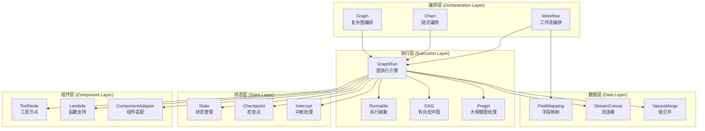
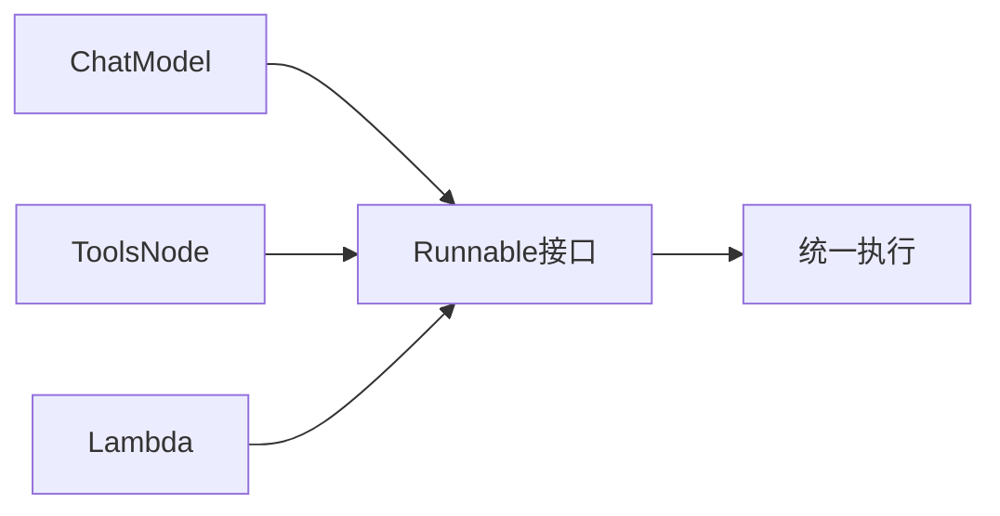
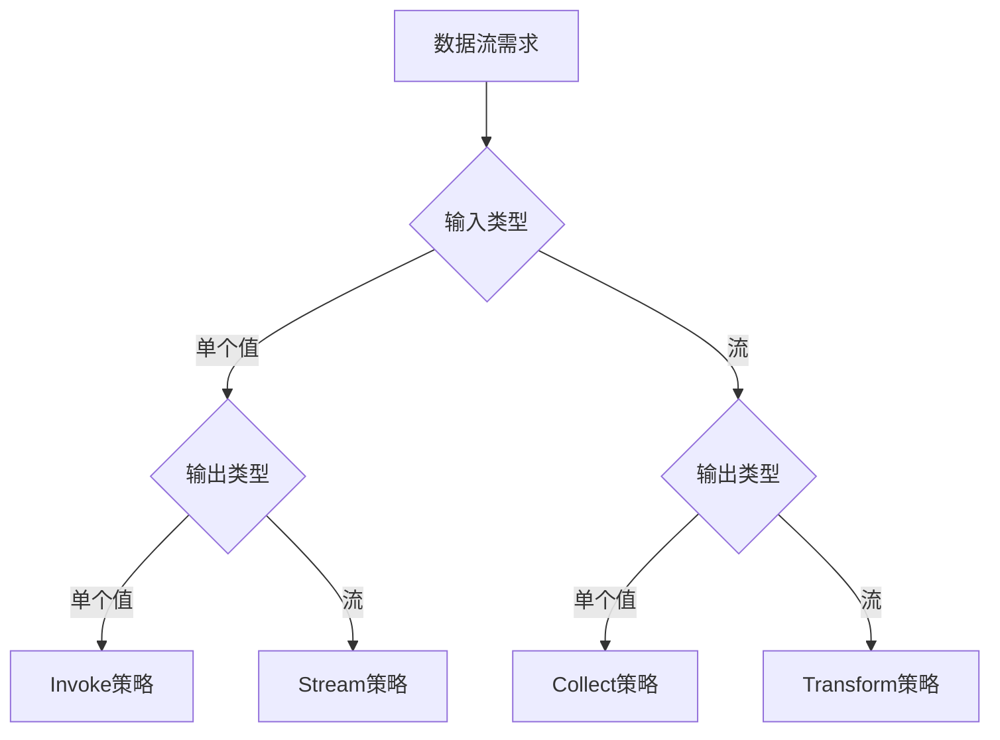
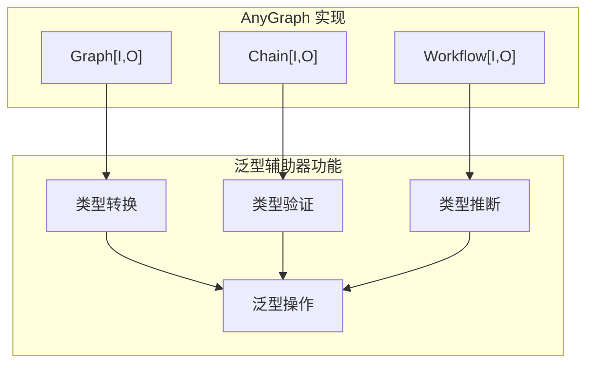

# 5.6 compose编排

**compose /kəm'poʊz/***vt.* 组成

compose遇到难点：

**1.**~~** Go 理论基础不够扎实 → 我会从基础概念开始**~~

**2. Go 代码开发实践太少 → 提供大量代码示例和练习**

**3.**~~** AI 概念太多 → 用通俗易懂的方式解释 AI 相关概念**~~

**4. **~~**工程应用框架设计没接触过 → 从设计模式角度解释**~~

## 一、compose包整体设计

传统代码开发过程中，用 代码的执行逻辑 来表达业务逻辑，直接迁移到大模型应用开发中时结果是：**代码杂乱、很难复用、没有切面能力…**

Eino 的初衷是让大模型应用开发变得非常简单，就一定要让应用的代码逻辑 简单、直观、优雅、健壮。


**Eino对compose的洞察：**

1. **compose要在components业务逻辑之上独立出清晰的一个逻辑层**，不能让业务逻辑混入到编排中：业务逻辑复杂度封装到**components**内部，上层的compose层拥有更全局的视角。
1. 大模型应用的核心是 **compose components（编排组件）**，**components是compose的 “第一公民”。数据在graph中流动，每个上下游node对流动的数据类型有对齐的要求。**
1. 业务场景的复杂度会直接映射到编排产物的复杂度上，只有**横向的切面治理能力（callback机制）**才能让复杂场景不至于失控。
1. 大模型保持高速发展，大模型应用也是，只有**具备扩展能力（calloption机制）的应用才拥有生命力**。**扩展性**是快速迭代中的系统最基本的诉求。


`**Eino compose**`：**基于Graph模型（node+edge）compose components + 上下游node对流动的数据类型对齐为基础 的compose解决方案****。**

### **compose包架构**




### 上下游类型对齐设计

Eino对每个node的input、output使用明确的类型，使用any、map[string]any将导致下游node需要额外使用类型断言来不断猜测传过来的值是否符合预期。


**模拟RAG模式：**


`graph.AddXXXNode(node_key, xxx, compose.WithOutputKey("outkey")`: 类型转化为 map[string]any。其中map 的 key 是 option 中指定的 OutputKey。一般用于多条边汇聚到某一个节点时。

`graph.AddXXXNode(node_key, xxx, compose.WithInputKey("inkey")`：获取上游输出的其中一个 key 的 value。


**模拟react agent的运行逻辑：condition分支（菱形）**


模拟chain agent运行逻辑：


若上下游的类型没有对齐，chain 会在 chain.Compile() 时返回错误。而 graph 会在 graph.AddXXXNode() 时就报错。

## **二、执行引擎**

```shell
├── ⚙️ 执行引擎
│   ├── runnable.go (16KB)                 # 可执行对象抽象，实现四种执行模式自动转换
│   ├── graph_run.go (26KB)                # 图执行引擎，实现任务调度和状态管理
│   ├── graph_manager.go (8.5KB)           # 图管理器，管理任务、通道和状态
│   ├── graph_node.go (4.5KB)              # 图节点定义，封装节点结构和行为
│   ├── dag.go (4.4KB)                     # DAG执行模式，有向无环图的执行实现
│   ├── pregel.go (2.2KB)                  # Pregel执行模式，大规模图处理实现
│   └── generic_graph.go (4.5KB)           # 泛型图操作，提供图操作的泛型实现

├── ⚙️ 类型定义
│   ├── types.go (1.7KB)                   # 基础类型定义，定义组件类型和节点触发模式
│   └── types_composable.go (974B)         # 可组合接口，定义AnyGraph统一编译接口
```

### **Runnable接口**

定义了框架中**所有可执行对象的基础接口：**

```go
type Runnable[I, O any] interface {
    Invoke(ctx context.Context, input I) (O, error)                    // **同步执行**
    Stream(ctx context.Context, input I) (*StreamReader[O], error)     // **流式输出**
    Collect(ctx context.Context, input *StreamReader[I]) (O, error)    // **收集流式输入**
    Transform(ctx context.Context, input *StreamReader[I]) (*StreamReader[O], error) // **流式转换**
}
```

提供了四种数据流模式的自动转换机制（I为输入类型，O为输出类型）：

| 入参 | 出参 | **func** | **example** | 
| --- | --- | --- | --- | 
| 非流式 | 非流式 | Invoke(ctx context.Context, input I) (O, error) | 用户问问题，机器人一次性回答 | 
| 非流式 | 流式 | Stream(ctx context.Context, input I) (*StreamReader[O], error) | 用户问问题，机器人逐字逐句回答（像 ChatGPT 那样） | 
| 流式 | 非流式 | Collect(ctx context.Context, input *StreamReader[I]) (O, error) | 用户连续发送多条消息，机器人汇总回答 | 
| 流式 | 流式 | Transform(ctx context.Context, input *StreamReader[I]) (*StreamReader[O], error) | 用户发送语音流，机器人实时转换为文字流 | 

**composableRunnable：**

- **类型擦除**：使用any类型避免泛型复杂性
- **反射支持**：保留类型信息用于运行时验证
- **元数据丰富**：包含执行器信息和图节点上下文
```go
type composableRunnable struct {
    i invoke                    // 类型擦除的invoke函数
    t transform                 // 类型擦除的transform函数
    
    inputType  reflect.Type     // 输入类型信息
    outputType reflect.Type     // 输出类型信息
    optionType reflect.Type     // 选项类型信息
    
    *genericHelper              // 泛型辅助工具
    
    isPassthrough bool          // 是否为透传节点
    meta *executorMeta          // 执行器元数据
    nodeInfo *nodeInfo          // 图节点信息（仅在图中可用）
}
```

**runnablePacker:**

- 包装用户提供的四个执行函数
- 提供类型安全的执行接口
- 支持上下文包装和回调集成
```go
type runnablePacker[I, O, TOption any] struct {
    i Invoke[I, O, TOption]
    s Stream[I, O, TOption]
    c Collect[I, O, TOption]
    t Transform[I, O, TOption]
}
```

**newRunnablePacker**:

- **最小依赖**：优先使用用户直接实现的方法
- **性能优化**：避免不必要的转换开销
- **完整性保证**：确保所有四个方法都可用
    ```mermaid
    graph TD
        A[检查用户实现] --> B{有Invoke?}
        B -->|是| C[直接使用Invoke]
        B -->|否| D{有Stream?}
        D -->|是| E[invokeByStream]
        D -->|否| F{有Collect?}
        F -->|是| G[invokeByCollect]
        F -->|否| H[invokeByTransform]
        
        C --> I[合成其他方法]
        E --> I
        G --> I
        H --> I
    ```
**流处理集成:**

StreamReader处理

流转换：框架提供了12个转换函数，实现任意执行模式之间的转换：

```go
// 基于Stream实现Invoke
func invokeByStream[I, O, TOption any](s Stream[I, O, TOption]) Invoke[I, O, TOption]

// 基于Collect实现Invoke  
func invokeByCollect[I, O, TOption any](c Collect[I, O, TOption]) Invoke[I, O, TOption]

// 基于Transform实现Invoke
func invokeByTransform[I, O, TOption any](t Transform[I, O, TOption]) Invoke[I, O, TOption]
```

**图系统集成：**

1. 节点包装
```go
func inputKeyedComposableRunnable(key string, r *composableRunnable) *composableRunnable {
    wrapper := *r
    wrapper.genericHelper = wrapper.genericHelper.forMapInput()
    
    i := r.i
    wrapper.i = func(ctx context.Context, input any, opts ...any) (output any, err error) {
        v, ok := input.(map[string]any)[key]
        if !ok {
            return nil, fmt.Errorf("cannot find input key: %s", key)
        }
        out, err := i(ctx, v, opts...)
        // ... 处理逻辑
    }
    
    return &wrapper
}
```

1. 透传节点
```go
func composablePassthrough() *composableRunnable {
    r := &composableRunnable{isPassthrough: true, nodeInfo: &nodeInfo{}}
    
    r.i = func(ctx context.Context, input any, opts ...any) (output any, err error) {
        return input, nil
    }
    
    r.t = func(ctx context.Context, input streamReader, opts ...any) (output streamReader, err error) {
        return input, nil
    }
    
    return r
}
```


**设计模式：**

**适配器模式：**Runnable接口作为适配器，统一了不同组件的执行接口：



**策略模式:**四种执行模式作为不同的策略，根据数据流需求选择



**装饰器模式:**composableRunnable作为装饰器，为原始组件添加类型安全、错误处理等能力。

**扩展性设计：**

- **插件化架构:**通过Option系统支持运行时配置和扩展。
- **回调集成:**支持执行前后的回调处理，便于监控和调试。
- **图系统集成:**无缝集成到图执行引擎中，支持复杂的编排场景。


### **types基础类型定义**

1. **核心组件类型定义：**最原始的可执行对象类型
```go
const (
    ComponentOfUnknown     component = "Unknown"
    ComponentOfGraph       component = "Graph"
    ComponentOfWorkflow    component = "Workflow"
    ComponentOfChain       component = "Chain"
    ComponentOfPassthrough component = "Passthrough"
    ComponentOfToolsNode   component = "ToolsNode"
    ComponentOfLambda      component = "Lambda"
)
```

1. **节点触发模式**
```go
const (
    AnyPredecessor NodeTriggerMode = "any_predecessor"  // 任意前驱节点完成即可触发: 适用于复杂工作流，支持循环和条件分支
    AllPredecessor NodeTriggerMode = "all_predecessor"  // 所有前驱节点完成才触发: 适用于 DAG（有向无环图）模式，确保确定性执行
)
```


1. AnyGraph接口：统一Graph、Chain、Workflow的编译接口
```go
type AnyGraph interface {
    getGenericHelper() *genericHelper    // 获取泛型辅助器
    compile(ctx context.Context, options *graphCompileOptions) (*composableRunnable, error)  // 编译为可执行对象
    inputType() reflect.Type            // 获取输入类型
    outputType() reflect.Type           // 获取输出类型
    component() component               // 获取组件类型
}
```

AnyGraph 接口体现了 Eino 框架的核心设计哲学：

1. **编译时类型安全**: 通过 inputType() 和 outputType() 方法，框架可以在编译时验证类型兼容性
1. **统一编译接口**: 所有图结构都通过 compile() 方法转换为 composableRunnable
1. **组件类型识别**: component() 方法允许运行时识别具体的组件类型


**泛型辅助器的作用：**

getGenericHelper() 返回的 *genericHelper 是类型系统的核心：




## **三、核心3种编排模式**

```shell
├── 🏗️ 核心编排模式
│   ├── graph.go (33KB)                    # 图编排系统，支持复杂DAG和循环执行
│   ├── chain.go (16KB)                    # 链式编排，提供Builder模式的线性工作流
│   └── workflow.go (16KB)                 # 工作流编排，基于字段映射的声明式编排
```


### **Chain（链式）**

Eino中的Chain是对 Graph 的降级封装。

```go
type Chain[I, O any] struct {
	err error
	gg *Graph[I, O]  // 封装Graph
	nodeIdx int
	preNodeKeys []string
	hasEnd bool
}
```


example:

```go
// 想象一个简单的聊天流程
chain := NewChain[string, string]().
    AppendChatTemplate("你是一个友好的助手").
    AppendChatModel(chatModel).
    Compile(ctx)

// 使用
result, err := chain.Invoke(ctx, "你好")
```


### **Graph图编排**

像流程图一样，可以有分支、循环、并行.


example:

```go
// 想象一个智能助手，可以调用不同工具
graph := NewGraph[string, string]()
graph.AddChatModelNode("chat", chatModel)
graph.AddToolsNode("tools", toolsNode)
graph.AddEdge(START, "chat")
graph.AddBranch("chat", branchCondition) // 如果有工具调用，去工具节点
graph.AddEdge("tools", "chat") // 工具执行完，回到聊天
```


### **Workflow工作流编排**

[https://www.cloudwego.io/zh/docs/eino/core_modules/chain_and_graph_orchestration/workflow_orchestration_framework/](https://www.cloudwego.io/zh/docs/eino/core_modules/chain_and_graph_orchestration/workflow_orchestration_framework/)

**Eino: Workflow 编排框架：**

专注于数据转换，精确控制每个字段的映射

```go
// 想象一个数据处理工作流
workflow := NewWorkflow[InputStruct, OutputStruct]()
workflow.AddChatModelNode("model", chatModel).
    AddInput(START)
workflow.AddLambdaNode("processor", processor).
    AddInput("model", MapFields("Content", "Input")) // 将 Content 字段映射到 Input
```


### **Chain/Graph 编排**

> [https://www.cloudwego.io/zh/docs/eino/core_modules/chain_and_graph_orchestration/chain_graph_introduction/#chain](https://www.cloudwego.io/zh/docs/eino/core_modules/chain_and_graph_orchestration/chain_graph_introduction/#chain) 
Eino**编排的设计理念**：[https://www.cloudwego.io/zh/docs/eino/core_modules/chain_and_graph_orchestration/orchestration_design_principles/](https://www.cloudwego.io/zh/docs/eino/core_modules/chain_and_graph_orchestration/orchestration_design_principles/)


## 四、分支和并行

```shell
── 🔀 分支和并行
│   ├── branch.go (5.6KB)                  # 分支逻辑，实现条件分支和路由
│   ├── chain_branch.go (10KB)             # 链式分支，为Chain提供条件路由功能
│   └── chain_parallel.go (7.3KB)          # 链式并行，实现并行执行和结果聚合
```


## 五、数据流处理

```shell
├── 📊 数据流处理
│   ├── field_mapping.go (22KB)            # 字段映射系统，实现字段级数据转换
│   ├── values_merge.go (2.2KB)            # 值合并，处理多个输入值的合并逻辑
│   ├── stream_concat.go (2.1KB)           # 流连接，实现流式数据的连接和聚合
│   └── stream_reader.go (3.1KB)           # 流读取器，提供流式数据的读取接口
```


## 六、Lambda和组件

```shell
├── 🔧 Lambda和组件
│   ├── types_lambda.go (9.4KB)            # Lambda类型定义，定义可调用和可流式函数类型
│   ├── component_to_graph_node.go (4.4KB) # 组件转换，将组件转换为图节点的适配器
│   ├── tool_node.go (16KB)                # 工具节点，实现工具调用和并行/串行执行
│   └── generic_helper.go (8.4KB)          # 泛型辅助，提供类型安全的泛型操作工具
```


## 七、状态管理

```shell
├── 🔧 状态管理
│   ├── state.go (5.0KB)                   # 状态管理，实现图执行过程中的本地状态
│   ├── checkpoint.go (9.2KB)              # 检查点系统，实现执行状态的保存和恢复
│   └── interrupt.go (2.7KB)               # 中断处理，实现执行过程中的中断和恢复
```


## 八、配置选项

```shell
├── ⚙️ 配置选项
│   ├── graph_compile_options.go (5.0KB)   # 图编译选项，定义图编译时的配置选项
│   ├── graph_call_options.go (6.0KB)      # 图调用选项，定义图执行时的运行时选项
│   └── graph_add_node_options.go (6.2KB)  # 节点添加选项，定义添加图节点时的配置

├── 🛠️ 工具和辅助
│   ├── utils.go (9.2KB)                   # 工具函数，提供回调集成和选项处理
│   ├── error.go (3.6KB)                   # 错误处理，定义框架的错误类型和处理机制
│   └── introspect.go (2.1KB)              # 内省功能，提供图结构的自省和调试功能
```


### **Eino 流式编程**

> **Eino 流式编程要点**：[https://www.cloudwego.io/zh/docs/eino/core_modules/chain_and_graph_orchestration/stream_programming_essentials/](https://www.cloudwego.io/zh/docs/eino/core_modules/chain_and_graph_orchestration/stream_programming_essentials/)


